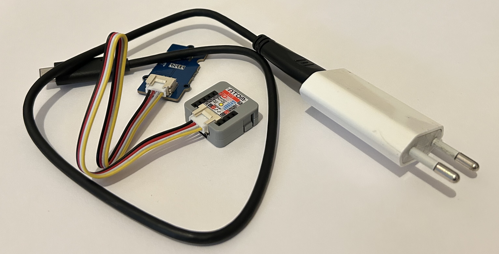

# Fichiers pour le tutoriel «mesurer la température chaque quart d’heure»

Lire le tutoriel: https://paulronga.ch/tuto-enregistrer-la-temperature-chaque-quart-dheure/

Ce dépôt contient trois répertoires:

* croquis_ESP32: le code pour le matériel recommandé (microcontrôleur Atom Lite et capteur Grove SHT35), en 4 étapes
* croquis_ESP8266: le code utilisé pour le bricolage d’origine, avec un vieux microcontrôleur ESP8266 et un baromètre BME280
* serveur: le code PHP à mettre sur un serveur. Le fichier put.php, destiné à collecter les mesures, est aussi en plusieurs versions.

